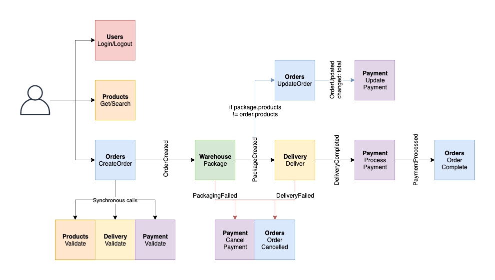
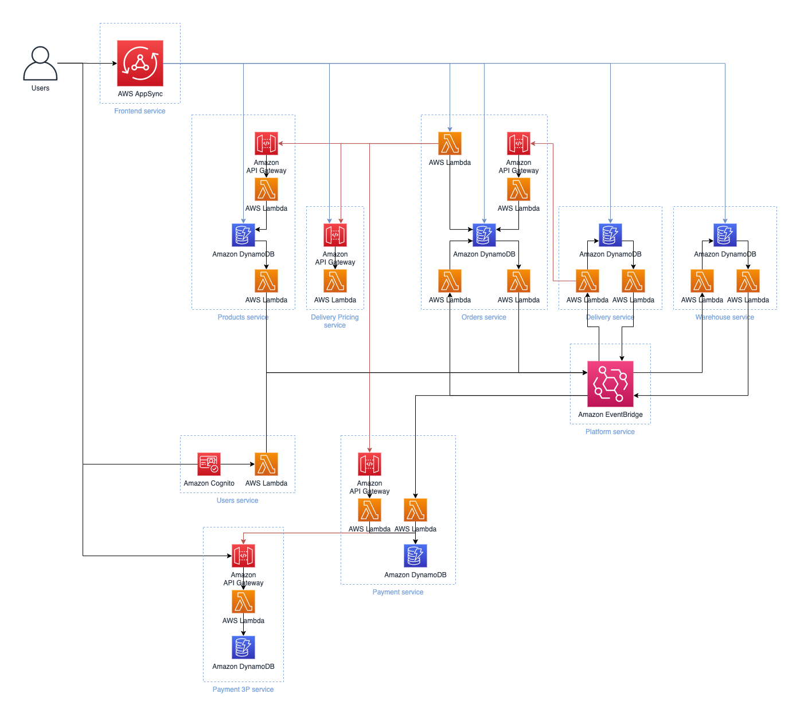

AWS Serverless Ecommerce Platform
=================================

__Status__: _Work-in-progress. Please create issues or pull requests if you have ideas for improvement._

The __Serverless Ecommerce Platform__ is a sample implementation of a serverless backend for an e-commerce website. Functionalities are split across multiple micro-services that communicate either through asynchronous messages over [Amazon EventBridge](https://aws.amazon.com/eventbridge/) or over synchronous APIs.

__This sample is not meant to be used as an e-commerce platform as-is, but as an inspiration on how to build event-driven serverless microservices on AWS.__ This makes lots of assumptions on the order flow that might not be suitable for most e-commerce platform and doesn't include many of the features that you might need for this.

_Please note that you may incure AWS charges for deploying the ecommerce platform into your AWS account as not all services used are part of the [free tier](https://aws.amazon.com/free/) and you might exceed the free tier usage limit. To track costs in your AWS account, consider using [AWS Cost Explorer](https://aws.amazon.com/aws-cost-management/aws-cost-explorer/) and [AWS Billing and Cost Management](https://docs.aws.amazon.com/awsaccountbilling/latest/aboutv2/billing-what-is.html). You can also set up a [billing alarm](https://docs.aws.amazon.com/AmazonCloudWatch/latest/monitoring/monitor_estimated_charges_with_cloudwatch.html) to get notified of unexpected charges._

  

## Getting started

To install the necessary tools and deploy this in your own AWS account, see the [getting started](docs/getting_started.md) guide in the documentation section.

## Architecture

### High-level architecture

This is a high-level view of how the different microservices interact with each other. Each service folder contains anarchitecture diagram with more details for that specific service.

  

### Technologies used

__Communication/Messaging__:

* [AWS AppSync](https://aws.amazon.com/appsync/) for interactions between users and the ecommerce platform.
* [Amazon API Gateway](https://aws.amazon.com/api-gateway/) for service-to-service synchronous communication (request/response).
* [Amazon EventBridge](https://aws.amazon.com/eventbridge/) for service-to-service asynchronous communication (emitting and reacting to events).

__Authentication/Authorization__:

* [Amazon Cognito](https://aws.amazon.com/cognito/) for managing and authenticating users, and providing JSON web tokens used by services.
* [AWS Identity and Access Management](https://aws.amazon.com/iam/) for service-to-service authorization, either between microservices (e.g. authorize to call an Amazon API Gateway REST endpoint), or within a microservice (e.g. granting a Lambda function the permission to read from a DynamoDB table).

__Compute__:

* [AWS Lambda](https://aws.amazon.com/lambda/) as serverless compute either behind APIs or to react to asynchronous events.

__Storage__:

* [Amazon DynamoDB](https://aws.amazon.com/dynamodb/) as a scalable NoSQL database for persisting informations.

__CI/CD__:

* [AWS CloudFormation](https://aws.amazon.com/cloudformation/) with [AWS Serverless Application Model](https://aws.amazon.com/serverless/sam/) for defining AWS resources as code in most services.
* [AWS Cloud Development Kit (CDK)](https://aws.amazon.com/cdk/) for defining AWS resources as code in the [payment-3p](payment-3p/) service.
* [Amazon CodeCommit](https://aws.amazon.com/codecommit/) as a repository to trigger the CI/CD pipeline.
* [Amazon CodeBuild](https://aws.amazon.com/codebuild/) for building artifacts for microservices and running tests.
* [Amazon CodePipeline](https://aws.amazon.com/codepipeline/) for orchestrating the CI/CD pipeline to production.

__Monitoring__:

* [Amazon CloudWatch](https://aws.amazon.com/cloudwatch/) for metrics, dashboards, log aggregation.
* [AWS X-Ray](https://aws.amazon.com/xray/) for tracing across AWS services and across microservices.

### Backend services

|  Services  | Description                               |
|------------|-------------------------------------------|
| [users](users/) | Provides user management, authentication and authorization. |
| [products](products/) | Source of truth for products information. |
| [orders](orders/) | Manages order creation and status. |
| [warehouse](warehouse/) | Manages inventory and packaging orders. |
| [delivery](delivery/) | Manages shipping and tracking packages. |
| [delivery-pricing](delivery-pricing/) | Pricing calculator for deliveries. |
| [payment](payment/) | Manages payment collection and refunds. |
| [payment-3p](payment-3p/) | Simulates a third party payment system. |

### Frontend service

|  Services  | Description                               |
|------------|-------------------------------------------|
| [frontend-api](frontend-api/) | User-facing API for interacting with the services. |

### Infrastructure services

|  Services  | Description                               |
|------------|-------------------------------------------|
| [pipeline](pipeline/) | CI/CD pipeline for deploying the resources in production. |
| [platform](platform/) | Core platform resources for deploying backend services. |

### Shared resources

| Name       | Description                               |
|------------|-------------------------------------------|
| [docs](docs/) | Documentation application for all services. |
| [shared](shared/) | Shared resources accessible for all services, such as common CloudFormation templates and OpenAPI schemas. |
| [tools](tools/) | Tools used to build services.             |

## Documentation

See the [docs](docs/) folder for the documentation.

## Contributing

See the [contributing](CONTRIBUTING.md) and [getting started](docs/getting_started.md) documents to learn how to contribute to this project.

## License

This library is licensed under the MIT-0 License. See the LICENSE file.
