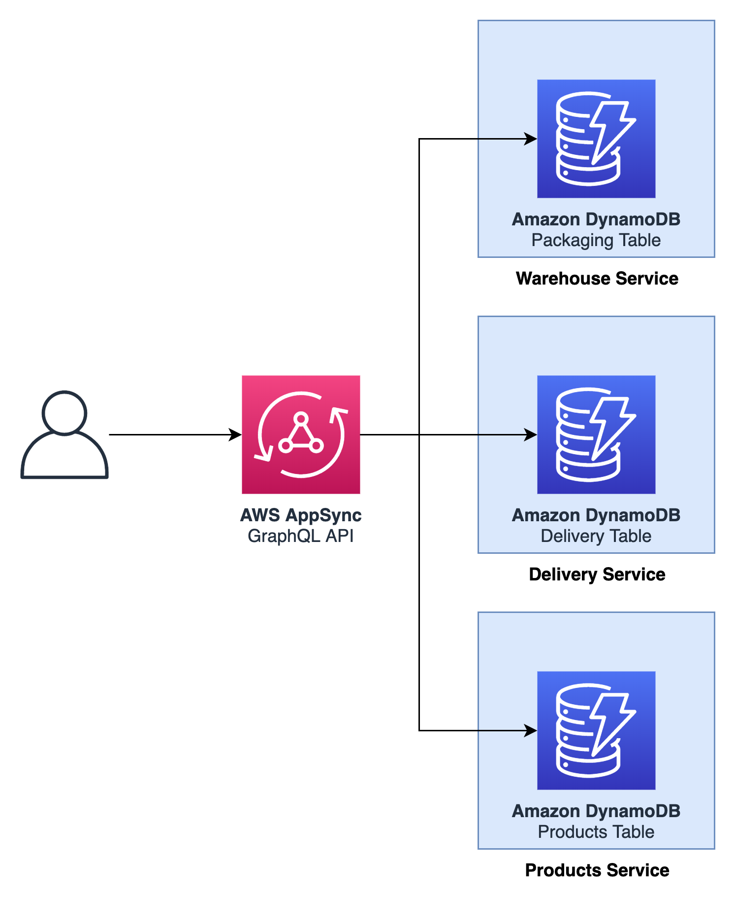

Backoffice API service
======================

  

## API

See [resources/api.graphql](resources/api.graphql) for the GraphQL API.

## Events

_None at the moment._

## SSM Parameters

This service defines the following SSM parameters:

* `/ecommerce/{Environment}/backoffice-api/api/arn`: ARN for the GraphQL API
* `/ecommerce/{Environment}/backoffice-api/api/id`: ID of the GraphQL API
* `/ecommerce/{Environment}/backoffice-api/api/url`: URL of the GraphQL API