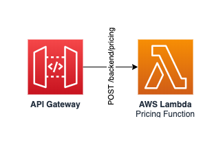

Delivery Pricing service
========================

    

This service provides an API to calculate the delivery cost for a specific list of products and an address.

## API

See [resources/openapi.yaml](resources/openapi.yaml) for a list of available API paths.

## Events

_This service does not emit events._

## SSM Parameters

This service defines the following SSM parameters:

* `/ecommerce/{Environment}/delivery-pricing/api/arn`: ARN for the API Gateway
* `/ecommerce/{Environment}/delivery-pricing/api/domain`: Domain name for the API Gateway
* `/ecommerce/{Environment}/delivery-pricing/api/url`: URL for the API Gateway