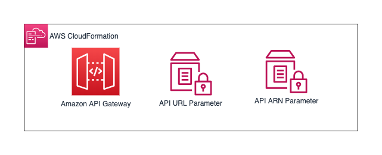
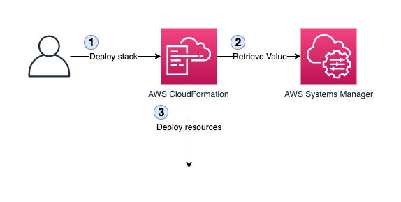
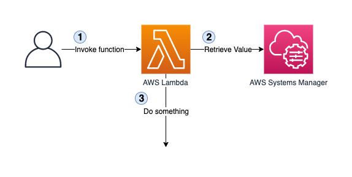

Service Discovery
=================

This project uses the [AWS Systems Manager Parameter Store](https://docs.aws.amazon.com/systems-manager/latest/userguide/systems-manager-parameter-store.html) to pass configuration information between services. There are two types of service discovery mechanisms: either by resolving values at deployment time or resolving values at runtime.

In the first case, the values are then embedded into the deployed pieces (e.g. environment variables for an AWS Lambda function). The biggest benefit of that approach is that it reduces the risk of failure, as resources don't need to fetch the parameter value at runtime. This also reduces the total execution time by removing a network call.

In the second case, the resource (e.g. an AWS Lambda function) would make a periodic call to the Parameter Store to retrieve a value. This could be done during a cold start, or the value could have an expiration period. For example, if the value in memory is older than 30 seconds, retrieve the latest version. This is useful for values that could change frequently, such as for circuit breakers or features flags.

Parameters used to pass information between services tend to change infrequently (such as an API URL), therefore the first case is almost always used.

## Creating parameters

<p align="center">
  
</p>

To create an AWS Systems Manager in your CloudFormation template, you need to create a resource of type [AWS::SSM::Parameter](https://docs.aws.amazon.com/AWSCloudFormation/latest/UserGuide/aws-resource-ssm-parameter.html). For example, if you want to expose the URL and ARN (Amazon Resource Name) of an API Gateway REST API:

```yaml
Resources:
  # This is a REST API defined using AWS SAM
  # See https://github.com/awslabs/serverless-application-model/blob/master/versions/2016-10-31.md#awsserverlessapi
  Api:
    Type: AWS::Serverless::Api
    Properties:
      StageName: prod
      # Put other properties here

  # First parameter containing the API URL
  ApiUrlParameter:
    Type: AWS::SSM::Parameter
    Properties:
      # See below for the naming convention
      Name: !Sub /ecommerce/${Environment}/${ServiceName}/api/url
      Type: String
      Value: !Sub "https://${Api}.execute-api.${AWS::Region}.amazonaws.com/prod"

  # Second parameter containing the API ARN
  # This could be used if the API requires service-to-service authorization
  # using IAM.
  ApiArnParameter:
    Type: AWS::SSM::Parameter
    Properties:
      Name: !Sub /ecommerce/${Environment}/${ServiceName}/api/arn
      Type: String
      Value: !Sub "arn:${AWS::Partition}:execute-api:${AWS::Region}:${AWS::AccountId}:${Api}/prod"
```

When deploying the CloudFormation stack, it will create these parameters and store the value based on the API Gateway REST API.

## Naming convention

As a convention throughout the project, all parameters in the parameter store should follow this convention: `/ecommerce/{Environment}/{Service}/{Name}/{Type}`. The _Environment_ section can be skipped for services that do not use environments. For example:

* `/ecommerce/dev/orders/api/url`
* `/ecommerce/prod/platform/event-bus/name`
* `/ecommerce/staging/products/table/name`

Prefixing with _ecommerce_ and the environment allows to deploy multiple projects and environments that use this naming convention within the same AWS account without conflict. For example, there could be an _analytics_ or _supply-chain_ domains that work in similar way from the ecommerce platform.

## Using parameter values

<p align="center">
  
</p>

In the case where parameter values are resolved at deployment time, we can use a [feature in AWS CloudFormation](https://docs.aws.amazon.com/AWSCloudFormation/latest/UserGuide/parameters-section-structure.html#aws-ssm-parameter-types) that allow passing the Systems Manager parameter names as CloudFormation Parameter and they get automatically resolved to their value. For example, if a service needs to retrieve the event bus name from the platform service:

```yaml
Parameters:
  # This CloudFormation stacks has a parameter named 'EventBusName' that can
  # be used to pass the event bus name value to various resources.
  EventBusName:
    # The parameter type indicates to CloudFormation that it needs to resolve
    # its value.
    Type: AWS::SSM::Parameter::Value<String>
    Description: EventBridge Event Bus Name

# The 'Globals' section is specific to AWS SAM
# See https://github.com/awslabs/serverless-application-model/blob/master/versions/2016-10-31.md#globals-section
Globals:
  Function:
    Environment:
      Variables:
        # This way, all Lambda functions will have access to the event bus name
        # using the EVENT_BUS_NAME environment variable.
        EVENT_BUS_NAME: !Ref EventBusName
```

The service's _metadata.yaml_ file contains a section called _parameters_ that maps CloudFormation parameter names to Systems Manager parameter names. For example, in this case:

```yaml
name: my-service
parameters:
  EventBusName: /ecommerce/{Environment}/platform/event-bus/name
```

During the build process, the [build tool](../tools/build#L61) invokes a [helper](../tools/helpers/build_artifacts) that will generate [template configuration files](https://docs.aws.amazon.com/AWSCloudFormation/latest/UserGuide/continuous-delivery-codepipeline-cfn-artifacts.html#w2ab1c13c17c15). These files contain an _Environment_ parameter, the parameters defined in the [environments.yaml](../environments.yaml) file, and parameters defined in the service's _metadata.yaml_ file. Variables in parameter values automatically get resolved.

In this case, the `{Environment}` value automatically gets resolved to the environment's value. For example, when deploying this service into the default environment (`dev`), the parameter will use the value of `/ecommerce/dev/platform/event-bus/name`. This value, in turn, will be used by CloudFormation to look up the actual event bus name provided by the _platform_ service.

## Runtime resolution of parameter values

<p align="center">
  
</p>

In the previous section, we looked at the most common case where parameters are resolved at deployment time. There are a few differences when wanting to resolve parameters at runtime.

The first one is that we need to keep the parameter name instead of resolving its value. This is done by changing the type in the parameter section of the CloudFormation template:

```yaml
Parameters:
  # This CloudFormation stacks has a parameter named 'EventBusNameParameter'
  # that contains the name of the event bus name parameter, not its value.
  EventBusNameParameter:
    # This is a string and therefore CloudFormation does not automatically
    # resolve the value.
    Type: String
    Description: EventBridge Event Bus Name Parameter Name

# The 'Globals' section is specific to AWS SAM
# See https://github.com/awslabs/serverless-application-model/blob/master/versions/2016-10-31.md#globals-section
Globals:
  Function:
    Environment:
      Variables:
        # This way, all Lambda functions will have access to the event bus name
        # parameter name using the EVENT_BUS_NAME_PARAMETER environment
        # variable.
        EVENT_BUS_NAME_PARAMETER: !Ref EventBusNameParameter
```

Since the AWS Lambda functions are no longer getting the resolved parameter, they will need to implement logic to retrieve the value. They will also need the permission to get the parameter:

```yaml
Resources:
  MyFunction:
    # This is a Lambda function defined using AWS SAM
    # See https://github.com/awslabs/serverless-application-model/blob/master/versions/2016-10-31.md#awsserverlessfunction
    Type: AWS::Serverless::Function
    Properties:
      Runtime: python3.8
      CodeUri: src/my_function/
      Handler: main.handler
      # This section adds an IAM policy that grants the permission to read the
      # parameter value.
      Policies:
        - Version: "2012-10-17"
            Statement:
              - Effect: Allow
                Action: ssm:GetParameter
                Resource: !Sub "arn:${AWS::Partition}:ssm:${AWS::Region}:${AWS::AccountId}:parameter/${EventBusNameParameter}"
```

Then, in the Lambda function (using Python 3):

```python
import datetime
import os
import time
import boto3


EVENT_BUS_NAME_PARAMETER = os.environ["EVENT_BUS_NAME_PARAMETER"]
EVENT_BUS_NAME = None
EVENT_BUS_TIMESTAMP = 0
EVENT_BUS_EXP_TIME = 60 # Expire the value after 60 seconds


ssm = boto3.client("ssm")
eventbridge = boto3.client("events")


def get_event_bus_name() -> str:
    """
    Retrieve the event bus name value.
    """

    # EVENT_BUS_NAME will be None during the first run. The second check
    # validates that the value is not too old. This basically acts like a
    # local cache with expiry.
    if EVENT_BUS_NAME is None or time.time() > EVENT_BUS_TIMESTAMP:
        # Resolve the value from AWS Systems Manager
        EVENT_BUS_NAME = ssm.get_parameter(
            Name=EVENT_BUS_NAME_PARAMETER
        )["Parameter"]["Value"]
        # Store the updated timestamp
        EVENT_BUS_TIMESTAMP = time.time() + EVENT_BUS_EXP_TIME

    return EVENT_BUS_NAME


def handler(event, _):
    """
    AWS Lambda function handler

    This just takes the event and puts it on EventBridge.
    """

    eventbridge.put_events(Entries=[{
        "Time": datetime.datetime.now(),
        "Source": "my-service",
        "Resources": [event["orderId"]],
        "DetailType": "SomeEvent",
        "Detail": json.dumps(event),
        # This will use the cached value or go back to Systems Manager if the
        # last known value is too old.
        "EventBusName": get_event_bus_name()
    }])
```