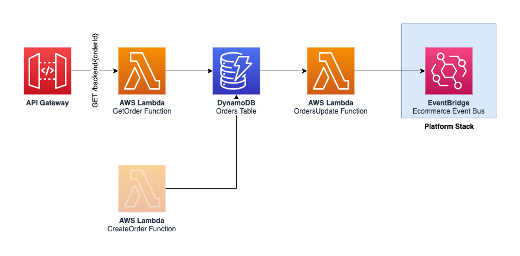
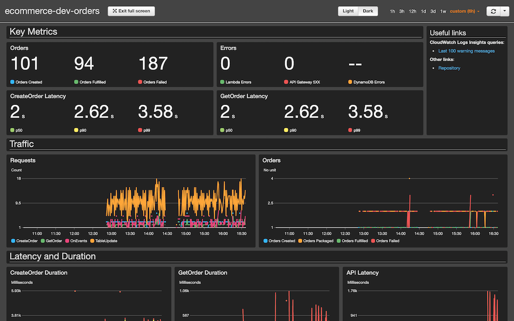

Orders service
==============

The __orders__ service acts a the single source of truth for data related to an order: delivery address, products, user, etc.

As orders are (somewhat) immutables, information about the delivery address and products are replicated within the order to ensure consistency over time. In some cases (e.g. if a product cannot be packaged, is substituted to another item, etc.), the order might be modified. This service also monitors the change in state from other services (mainly delivery and warehouse) so that users can probe the status of their order.

When a user creates an order, this service also acts as a central gate that contacts other services to verify that the user input is valid. For example, this checks that the products exist and that the prices are correct. If any check fails, this will return an error to the end-user.

    

## Monitoring and KPIs

On the business level, the main key performance indicators (KPIs) are the number of order created. The service should also track the number of orders fulfilled and failed. However, these metrics are the result of actions from other services.

From an operational point of view, the latency or errors from the CreateUpdate Lambda function are directly visible to end-users, and therefore should be measured closely. For this purpose, there is an alarm that is breached if the latency exceeds 1 second at p99, meaning that more than 1% of all requests take more than 1 second to complete.

The number of errors from all components and latency for the GetOrder (internal API call) is also tracked as a secondary operational metric.

    

## API

See [resources/openapi.yaml](resources/openapi.yaml) for a list of available API paths.

## Events

See [resources/events.yaml](resources/events.yaml) for a list of available events.

## SSM Parameters

This service defines the following SSM parameters:

* `/ecommerce/{Environment}/orders/api/url`: URL for the API Gateway
* `/ecommerce/{Environment}/orders/api/arn`: ARN for the API Gateway
* `/ecommerce/{Environment}/orders/create-order/arn`: ARN for the Create Order Lambda Function