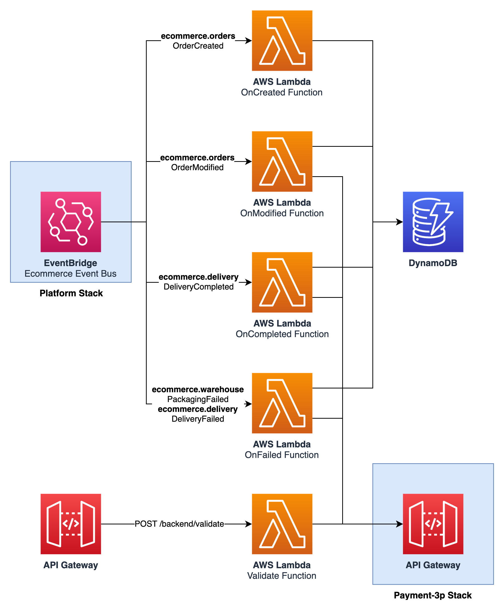
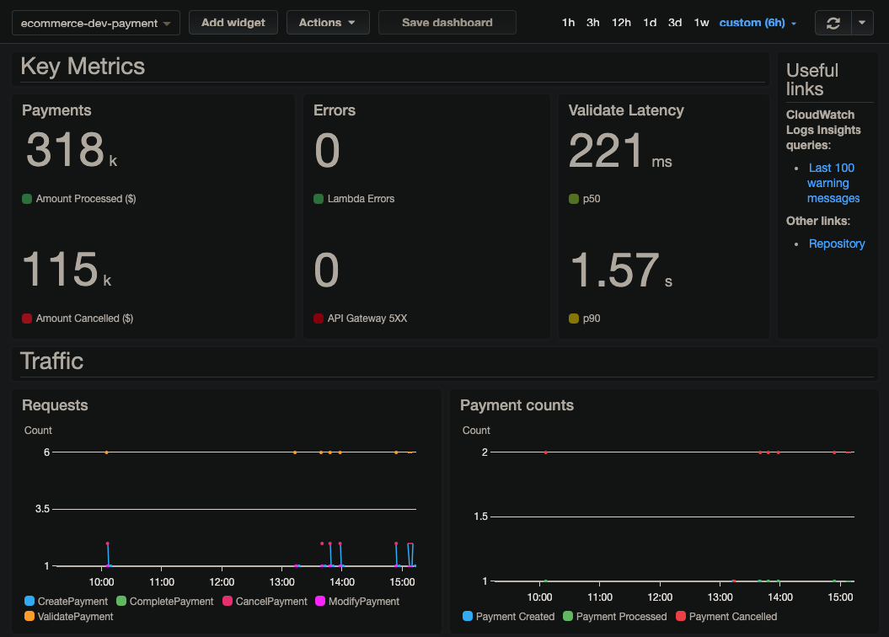

Payment service
===============

    

## API

See [resources/openapi.yaml](resources/openapi.yaml) for a list of available API paths.

## Monitoring and KPIs

On the business level, the main key performance indicators (KPIs) are the number of payments processed and the corresponding amount. The service should also track the number of cancelled payments or updated payments and the corresponding loss.

From an operational point of view, errors in lambda functions and API Gateway are important as well as the latency of the Validate function which is called synchronously from the order creation.

Then, latency & duration of all other functions are also tracked and visible in the dashboard.

    

## Events

_This service does not publish events._

## SSM Parameters

This service defines the following SSM parameters:

* `/ecommerce/{Environment}/payment/api/url`: URL for the API Gateway
* `/ecommerce/{Environment}/payment/api/arn`: ARN for the API Gateway
