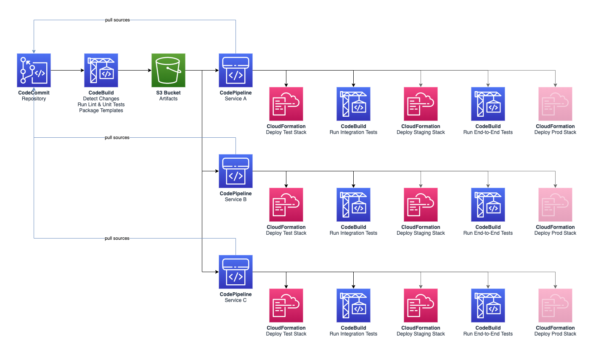

Ecommerce Platform Pipeline
===========================

Whenever there is a commit pushed to the main branch of the [CodeCommit repository](https://aws.amazon.com/codecommit/), this triggers a [CodeBuild project](https://aws.amazon.com/codebuild/) that will detect which services have changed since the last project execution, run lint and unit tests and send artifacts to an S3 bucket. See [resources/buildspec-build.yaml](resources/buildspec-build.yaml) for the build specification.

Each service has its own [pipeline powered by CodePipeline](https://aws.amazon.com/codepipeline/). When a new version of the artifacts for that service is uploaded to S3, this will trigger the pipeline.

The pipeline will first fetch the sources from CodeCommit, deploy the stack to a testing environment and run integration tests against that stack. See [resources/buildspec-tests.yaml](resources/buildspec-tests.yaml) for the build specification.