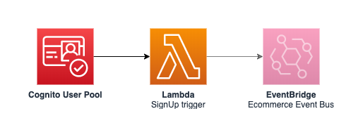

Users service
=============

## API

This service does not define any API.

## Events

See [resources/events.yaml](resources/events.yaml) for a list of available events.

## SSM Parameters

This service defines the following SSM parameters:

* `/ecommerce/${Environment}/users/user-pool/id`: ID of the underlying Cognito User Pool
* `/ecommerce/${Environment}/users/user-pool/arn`: ARN of the underlying Cognito User Pool