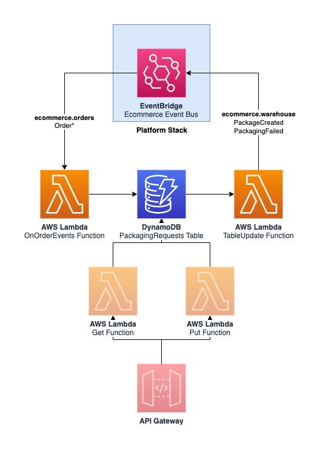

Warehouse service
=================

  

The __warehouse__ service handles packaging incoming orders into packages ready for delivery.

## API

_None at the moment._

## Events

See [resources/events.yaml](resources/events.yaml) for a list of available events.

## SSM Parameters

* `/ecommerce/{Environment}/warehouse/api/url`: URL for the API Gateway